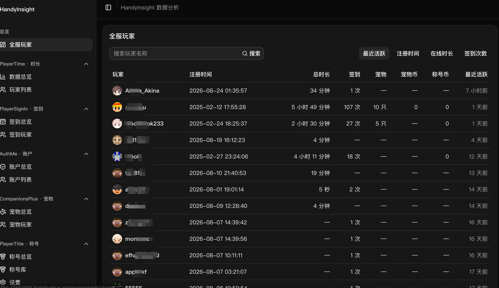
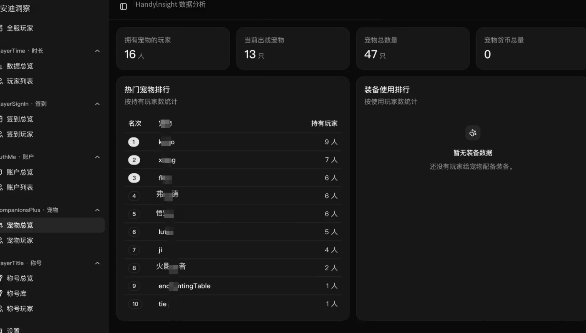

# HandyInsight

一个面向 Minecraft 服务器管理者的插件数据分析面板。

连接服务器的 MySQL 数据库后，可以在浏览器中查看玩家活跃、在线时长、签到、宠物、称号等数据。HandyInsight 只读取数据，不会修改游戏数据库。



## 可以查看什么

- **全服玩家**：集中搜索玩家，查看注册时间、在线时长、签到次数、宠物和最近活跃时间。
- **在线时长**：查看当前在线、今日活跃、在线趋势和玩家排行。
- **每日签到**：查看签到趋势、今日名单、累计排行和补签卡数量。
- **登录账户**：查看注册、登录和近期活跃情况。
- **宠物数据**：查看宠物数量、出战情况、热门宠物和玩家排行。
- **称号数据**：查看热门称号、称号库、玩家佩戴情况和称号币排行。

系统会根据数据库中已有的数据表自动显示可用功能，没有安装的插件不会出现在菜单中。

## 界面预览

### 在线时长与签到

通过趋势图和排行快速了解服务器活跃情况。

| 在线时长                                            | 每日签到                                    |
|-----------------------------------------------------|---------------------------------------------|
|  |  |

### 宠物与称号

查看玩家宠物、热门称号以及游戏内富文本颜色效果。

| 宠物数据                                    | 称号数据                                    |
|---------------------------------------------|---------------------------------------------|
|  |  |

### 称号库

称号名称、价格、有效期、粒子、属性和上下架状态一目了然。


## 支持的插件

| 插件           | 可查看内容                             |
|----------------|----------------------------------------|
| PlayerTime     | 在线人数、在线趋势、时长排行、玩家记录 |
| PlayerSignIn   | 签到趋势、签到排行、签到日历、补签卡   |
| AuthMe         | 注册与登录统计、活跃账户、账户详情     |
| CompanionsPlus | 宠物排行、宠物等级、出战状态、装备使用 |
| PlayerTitle    | 热门称号、称号库、佩戴状态、称号币     |

## 快速开始

准备好 Node.js、pnpm 和一个可访问的 MySQL 数据库，然后运行：

```bash
pnpm install
pnpm dev
```

打开 <http://localhost:3000>，按页面提示完成设置：

1. 使用环境变量设置登录账号和密码。
2. 填写 MySQL 地址、端口、数据库名、用户名和密码。
3. 测试连接，确认检测到至少一个支持的插件。
4. 保存配置并进入分析面板。

建议为 HandyInsight 创建只有 `SELECT` 权限的独立数据库账号。

## 登录设置

在启动应用前设置管理面板的登录账号：

```dotenv
AUTH_USERNAME=admin
AUTH_PASSWORD=请替换为强密码
```

登录状态有效期为 7 天。修改账号或密码并重启应用后，旧登录状态会自动失效。

## MySQL 设置

本地运行时可以直接在设置页面保存 MySQL 配置。配置保存在服务器本地的 `.data/mysql.json` 中，不会返回浏览器，也不会提交到
Git。

部署时也可以使用环境变量：

```dotenv
MYSQL_HOST=127.0.0.1
MYSQL_PORT=3306
MYSQL_DATABASE=minecraft
MYSQL_USER=handyinsight
MYSQL_PASSWORD=请替换为数据库密码
MYSQL_SSL=false
MYSQL_SSL_VERIFY=true
```

只要设置了任意 `MYSQL_*` 变量，应用就会优先使用环境变量。启用 TLS 时将 `MYSQL_SSL` 设为 `true`；只有使用自签名证书时，才建议关闭
`MYSQL_SSL_VERIFY`。

## 使用提醒

- HandyInsight 设计为个人管理工具，请勿在没有登录保护的情况下暴露到公网。
- 生产环境建议使用 HTTPS，并设置强登录密码。
- 玩家头像由 [mc-heads.net](https://mc-heads.net/) 提供，无法查询时会显示默认头像。
- 页面支持浅色、深色和跟随系统三种外观。

## 技术信息

HandyInsight 使用 Next.js、TypeScript、shadcn/ui 和 MySQL 构建，支持 Node.js 自托管与 EdgeOne Makers 部署。

项目采用可插拔结构，欢迎通过 Issue 或 Pull Request 提交新的插件支持。
