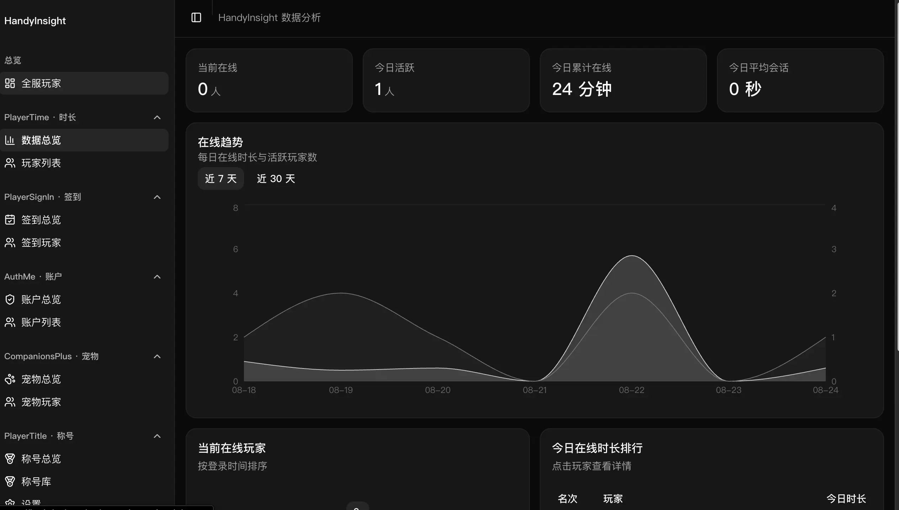
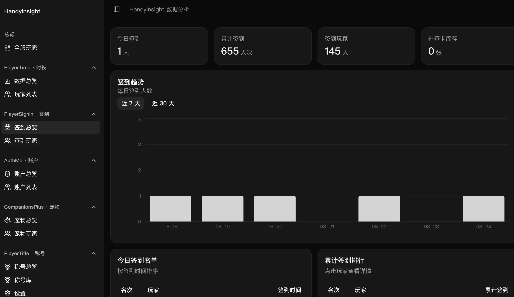
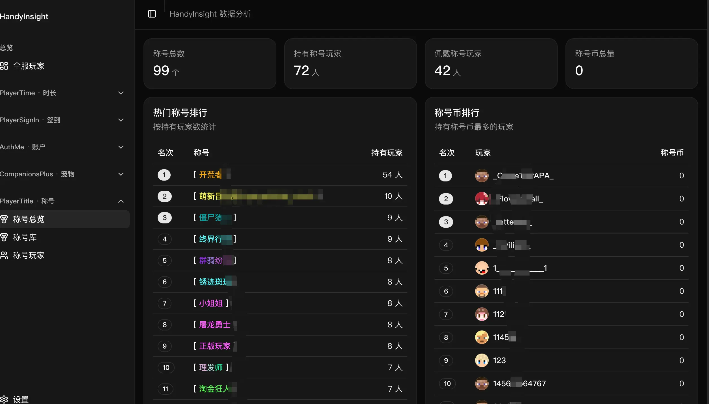
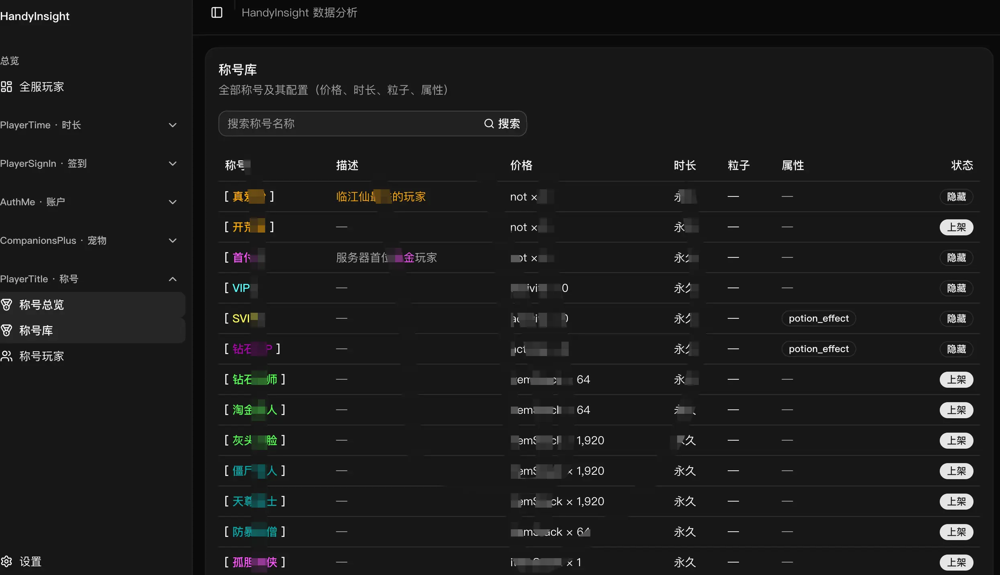
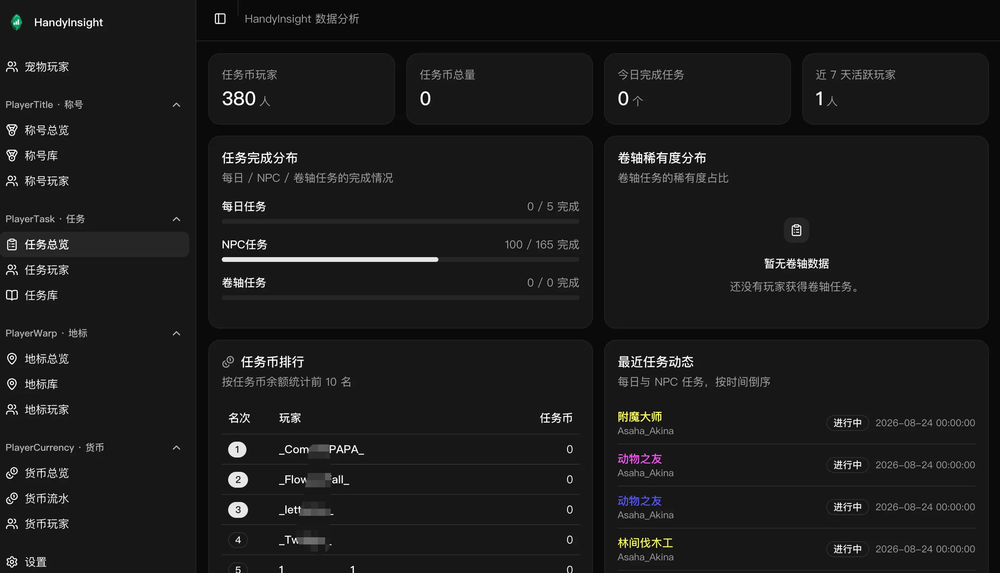
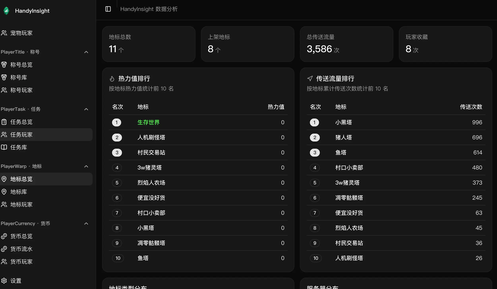
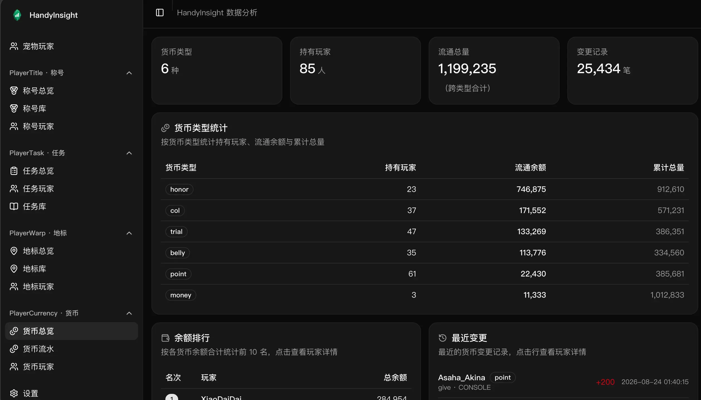
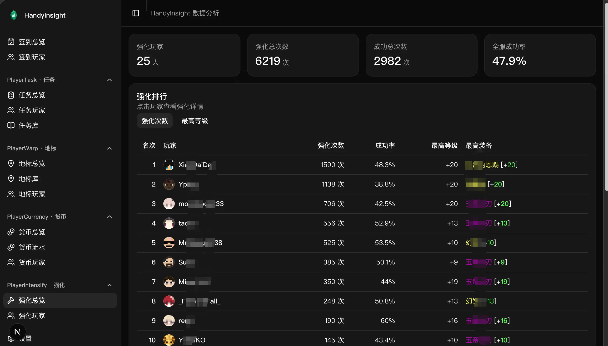
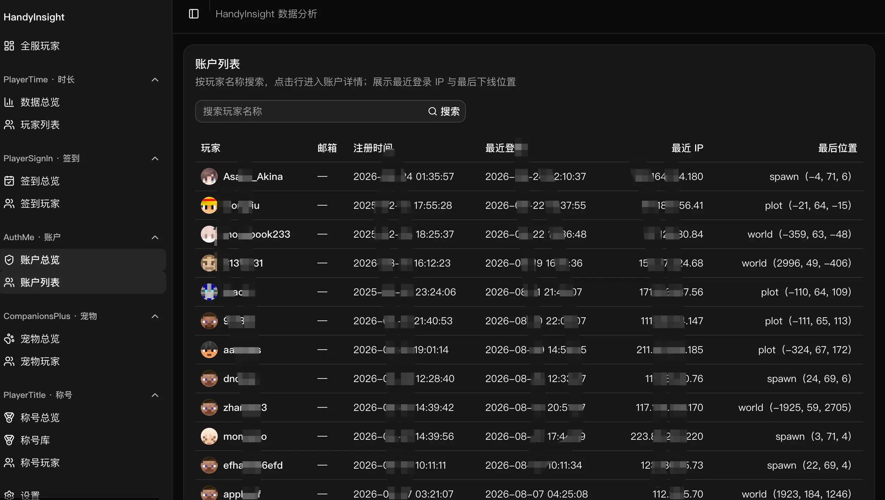

#  HandyInsight

一个面向 Minecraft 服务器管理者的插件数据分析面板。

连接服务器的 MySQL 数据库后，可以在浏览器中查看玩家活跃、在线时长、签到、宠物、称号、公会等数据。HandyInsight 只读取数据，不会修改游戏数据库。


## 可以查看什么

- **全服玩家**：集中搜索玩家，查看注册时间、在线时长、签到次数、宠物、所属公会和最近活跃时间。
- **在线时长**：查看当前在线、今日活跃、在线趋势和玩家排行。
- **每日签到**：查看签到趋势、今日名单、累计排行和补签卡数量。
- **登录账户**：查看注册、登录和近期活跃情况。
- **小精灵数据**：查看小精灵数量、出战情况、热门小精灵和玩家排行。
- **称号数据**：查看热门称号、称号库、玩家佩戴情况和称号币排行。
- **任务系统**：查看任务币、每日/NPC/卷轴任务完成情况和任务库配置。
- **地标系统**：查看地标热力/流量排行、类型与服务器分布、地标库、上架置顶状态、传送和收藏数据。
- **货币系统**：查看各货币类型流通统计、余额排行、货币流水与变更原因。
- **强化系统**：查看强化总览、强化次数/最高等级排行、成功率、最高装备与失败/掉级/消失统计。
- **公会系统**：查看公会总数、成员与资金统计、签到趋势、公会列表与详情（成员、申请审批、公会战 K/D、商店记录）。
- **权限管理**：查看权限玩家、权限组列表与成员、组权限节点和操作日志趋势。
- **MyPet 宠物**：查看宠物总数、类型分布、出战状态、技能树分布和玩家持有排行。
- **排行系统**：查看各排行榜参与人数、最高值与玩家排名，以及排行奖励发放记录。

系统会根据数据库中已有的数据表自动显示可用功能，没有安装的插件不会出现在菜单中。

## 界面预览

### 在线时长与签到

通过趋势图和排行快速了解服务器活跃情况。

| 在线时长                                | 每日签到                        |
|-----------------------------------------|---------------------------------|
|  |  |

### 小精灵与称号

查看玩家小精灵、热门称号以及游戏内富文本颜色效果。

| 小精灵数据                      | 称号数据                        |
|---------------------------------|---------------------------------|
|  |  |

### 称号库

称号名称、价格、有效期、粒子、属性和上下架状态一目了然。



### 任务、地标、货币与强化

查看任务完成进度、地标热力排行、货币流通统计和强化排行。

| 任务系统                        | 地标系统                        |
|---------------------------------|---------------------------------|
|  |  |

| 货币系统                        | 强化系统                        |
|---------------------------------|---------------------------------|
|  |  |

### 登录账户

查看玩家注册、登录和近期活跃情况。



## 支持的插件

| 插件            | 可查看内容                                               |
|-----------------|----------------------------------------------------------|
| PlayerTime      | 在线人数、在线趋势、时长排行、玩家记录                   |
| PlayerSignIn    | 签到趋势、签到排行、签到日历、补签卡                     |
| AuthMe          | 注册与登录统计、活跃账户、账户详情                       |
| CompanionsPlus  | 小精灵排行、小精灵等级、出战状态、装备使用             |
| PlayerTitle     | 热门称号、称号库、佩戴状态、称号币                       |
| PlayerTask      | 任务币、每日/NPC/卷轴任务、完成进度、任务库              |
| PlayerWarp      | 地标排行、地标库与详情、上架置顶、传送与收藏             |
| PlayerCurrency  | 货币类型统计、余额排行、货币流水、玩家余额               |
| PlayerGuild     | 公会列表与详情、成员角色、申请审批、公会战 K/D、商店购买 |
| PlayerIntensify | 强化次数、成功率排行、最高等级与装备、失败/掉级/消失统计 |
| LuckPerms       | 权限组与成员、组权限节点、直接权限、操作日志趋势          |
| MyPet           | 宠物总数、类型分布、出战状态、技能树分布、玩家持有排行    |
| PlayerTop       | 排行榜概览、玩家排名、发奖记录                            |

## 快速开始

以下四种方式任选其一。

### 1. EdgeOne Makers（一键部署）

不想自建环境？一键部署到 EdgeOne Makers（腾讯云）：

[](https://console.cloud.tencent.com/edgeone/makers/new?repository-url=https%3A%2F%2Fgithub.com%2Fhandy-git%2FHandyInsight&install-command=pnpm%20install&build-command=pnpm%20build&env=AUTH_USERNAME%2CAUTH_PASSWORD%2CMYSQL_HOST%2CMYSQL_PORT%2CMYSQL_DATABASE%2CMYSQL_USER%2CMYSQL_PASSWORD&env-description=%E9%83%A8%E7%BD%B2%E5%BF%85%E9%9C%80%EF%BC%9AAUTH_USERNAME%2FAUTH_PASSWORD%20%E4%B8%BA%E7%99%BB%E5%BD%95%E8%B4%A6%E5%8F%B7%E4%B8%8E%E5%AF%86%E7%A0%81%EF%BC%88%E5%BF%85%E5%A1%AB%EF%BC%89%EF%BC%9BMYSQL_*%20%E4%B8%BA%20MySQL%20%E7%9B%B4%E8%BF%9E%E9%85%8D%E7%BD%AE%EF%BC%88%E5%8F%AF%E9%80%89%EF%BC%8C%E8%AE%BE%E7%BD%AE%E5%90%8E%E4%BC%98%E5%85%88%E4%BA%8E%E8%AE%BE%E7%BD%AE%E9%A1%B5%E9%85%8D%E7%BD%AE%EF%BC%89&env-link=https%3A%2F%2Fgithub.com%2Fhandy-git%2FHandyInsight%23%E6%9C%AC%E5%9C%B0%E6%B5%8B%E8%AF%95%E9%85%8D%E7%BD%AE)

### 2. Docker Compose（推荐）

公网可直接拉取预构建镜像，无需本地安装 Node.js / pnpm。仓库根目录已自带 `docker-compose.yml`。

1. 编辑根目录 `docker-compose.yml`，修改 `AUTH_USERNAME` 与 `AUTH_PASSWORD`。
2. 二选一配置 MySQL：
   - 取消 `MYSQL_*` 注释，通过环境变量直连（设置后页面配置项只读）；
   - 保持 `MYSQL_*` 注释，稍后在页面中填写并保存。
3. 启动：

   ```bash
   docker compose up -d
   ```

4. 打开 <http://localhost:3000>，按提示完成设置。

### 3. Docker Run

```bash
docker run -d \
  --name handy-insight \
  --restart unless-stopped \
  -p 3000:3000 \
  -e AUTH_USERNAME=admin \
  -e AUTH_PASSWORD=change-me \
  -v handy-insight-data:/app/.data \
  crpi-5gak5n71wxx1qpzi.cn-shanghai.personal.cr.aliyuncs.com/handyplus/handy-insight:latest
```

### 4. 本地启动

准备好 Node.js、pnpm 和一个可访问的 MySQL 数据库，然后运行：

```bash
pnpm install
pnpm dev
```

打开 <http://localhost:3000>，按页面提示完成设置：

1. 使用环境变量设置登录账号和密码。
2. 填写 MySQL 地址、端口、数据库名、用户名和密码。
3. 测试连接，确认检测到至少一个支持的插件。
4. 保存配置并进入分析面板。

### 配置说明

- **登录账号**：`AUTH_USERNAME` / `AUTH_PASSWORD` 为必填，缺失时无法登录。
- **MySQL 连接**：设置任意一个 `MYSQL_*` 环境变量后，以环境变量为准，页面设置项变为只读；全部留空则通过页面填写。
- **数据持久化（Docker）**：镜像以非 root 用户运行，配置写入 `/app/.data`。使用命名卷（如 `handy-insight-data`）会自动持久化且无需处理目录权限；如需绑定宿主机目录，请确保该目录对 uid 1001 可写。

## 本地测试配置

本地联调时，在项目根目录新建 `.env.local` 配置登录账号与MySQL连接

```dotenv
# 登录账号（必需）
AUTH_USERNAME=admin
AUTH_PASSWORD=123456

# MySQL 连接（设置了任意 MYSQL_* 变量后优先于设置页配置）
MYSQL_HOST=127.0.0.1
MYSQL_PORT=3306
MYSQL_DATABASE=mc
MYSQL_USER=root
MYSQL_PASSWORD=123456
```

## 使用提醒

- HandyInsight 设计为个人管理工具，请勿在没有登录保护的情况下暴露到公网。
- 生产环境建议使用 HTTPS，并设置强登录密码。
- 玩家头像由 [mc-heads.net](https://mc-heads.net/) 提供，无法查询时会显示默认头像。
- 页面支持浅色、深色和跟随系统三种外观。

## 技术信息

HandyInsight 使用 Next.js、TypeScript、shadcn/ui 和 MySQL 构建，支持 Node.js 自托管与 EdgeOne Makers 部署。

项目采用可插拔结构，欢迎通过 Issue 或 Pull Request 提交新的插件支持。

## 支持项目

如果 HandyInsight 对你的服务器有帮助，欢迎到 [GitHub](https://github.com/handy-git/HandyInsight) 点一个 Star，也欢迎在
Issue 里告诉我们你使用的插件和需求，帮助项目持续改进。
